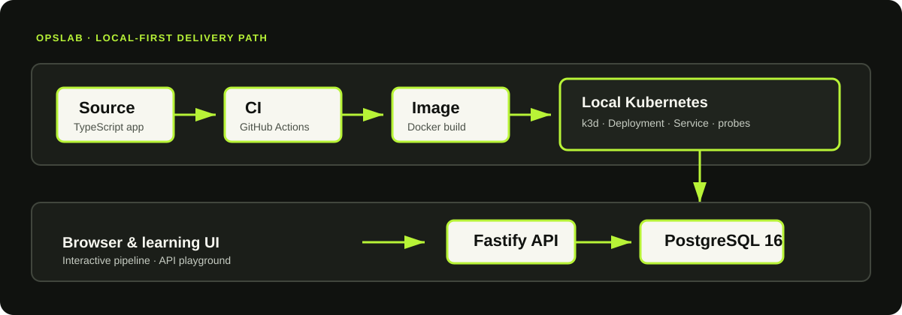

# OpsLab

> A local-first DevOps field guide that lets you follow a service from code to container to cluster—without a cloud bill.

OpsLab is a deliberately small, fully working platform for learning the code-to-deploy lifecycle. It pairs an interactive browser-based study guide with a TypeScript API, PostgreSQL, Docker Compose, Kubernetes manifests, Terraform, and CI.



## Why OpsLab?

Most DevOps tutorials teach tools in isolation. OpsLab connects the dots: each concept in the UI points to real configuration and runnable code in this repository. You can inspect it, change it, break it safely, and see what happens.

- **Local-first** — learn production-shaped practices without requiring a cloud account.
- **Interactive** — explore the CI pipeline, request lifecycle, runtime topology, and an API playground in the included web UI.
- **Real artifacts** — Docker, Compose, Kubernetes, Terraform, PostgreSQL, health probes, and GitHub Actions are all part of the project.
- **Small by design** — enough moving pieces to be realistic, small enough to understand end-to-end.

## What’s inside

| Area | What you’ll find |
| --- | --- |
| Application | Fastify + TypeScript service with health, service, incident, and metrics endpoints |
| Data | PostgreSQL 16 with a connection-pooled API |
| Local runtime | Multi-stage Docker build and Docker Compose |
| Delivery | GitHub Actions CI: install, type-check, test, image build, plus Terraform, Kubernetes manifest, and Compose validation |
| Orchestration | Kubernetes Deployment, Service, namespace, readiness, and liveness probes |
| Infrastructure as code | Terraform declarations for the Kubernetes resources |
| Learning UI | Interactive pipeline, architecture, measured request trace, concept lessons with simulators, API playground, and incident and deployment labs |
| Observability | Optional Prometheus and Grafana with a provisioned dashboard |

## Quick start

**Prerequisites:** Node.js 22+ and npm. Docker Desktop is optional but recommended for the complete stack.

```bash
git clone https://github.com/<your-account>/opslab.git
cd opslab/app
npm ci
npm run dev
```

Open [http://localhost:3000](http://localhost:3000) and start with the pipeline walkthrough.

To run the API and PostgreSQL together:

```bash
docker compose up --build
```

Set `OPSLAB_PORT` to expose the UI on a different host port, for example `OPSLAB_PORT=8080 docker compose up --build`.

Add Prometheus (port 9090) and Grafana (port 3001) with a ready-made dashboard:

```bash
docker compose --profile observe up --build
```

## Architecture

```text
Developer → GitHub → GitHub Actions → Docker image → local registry → k3d / Kubernetes
                                                                       │
Browser ───────────────────────────────────────────────────────→ Fastify API → PostgreSQL
```

The project intentionally keeps its delivery environment local. The same boundaries—source, CI, image, deployment, runtime configuration, health, and observability—transfer directly to a managed cloud platform.

## Explore the service

| Endpoint | Purpose |
| --- | --- |
| `GET /health/live` | Is the process alive? |
| `GET /health/ready` | Can it serve meaningful work? Answers `503` when it cannot |
| `GET /api/services` | List services in the lab |
| `POST /api/services` | Create a service |
| `GET /api/incidents` | List incidents |
| `POST /api/incidents` | Create an incident |
| `PATCH /api/incidents/:id` | Update an incident |
| `GET /api/ops/summary` | JSON summary with a rolling request-rate and latency window |
| `GET /api/events` | Server-Sent Events for incident, service, and fault changes |
| `GET` / `POST` / `DELETE /api/chaos` | Read, inject, or clear a self-expiring fault for the incident lab |
| `GET /metrics` | Prometheus metrics: labelled request counters and a duration histogram |

## Repository map

```text
opslab/
├── app/                 # Fastify service and interactive learning UI
├── kubernetes/          # Native Kubernetes manifests
├── terraform/           # Terraform-managed Kubernetes resources
├── observability/       # Prometheus scrape config and Grafana provisioning
├── scripts/             # Local k3d setup and deployment helpers
├── .github/workflows/   # Continuous integration
├── docker-compose.yml   # Full local runtime
└── Makefile             # Common development commands
```

## Common commands

```bash
# App quality checks
cd app && npm run lint && npm test && npm run build

# Local containers
docker compose up --build

# Create a local k3d cluster
./scripts/setup-k3d.ps1

# Preview infrastructure changes
terraform -chdir=terraform plan
```

See the focused setup notes in [app/README.md](app/README.md) and [kubernetes/README.md](kubernetes/README.md).

## Learning path

1. Run the app and use the interactive guide.
2. Build and run the image; compare the image with its running container.
3. Start Compose and trace the API-to-PostgreSQL connection.
4. Read the CI workflow and reproduce its checks locally.
5. Create the k3d cluster and deploy the manifests.
6. Preview the equivalent Terraform-managed infrastructure.

## Contributing

Contributions that make the lab clearer, safer, or more useful are welcome. Please read [CONTRIBUTING.md](CONTRIBUTING.md), run the checks before opening a pull request, and keep changes focused.

## License

Distributed under the [MIT License](LICENSE).
